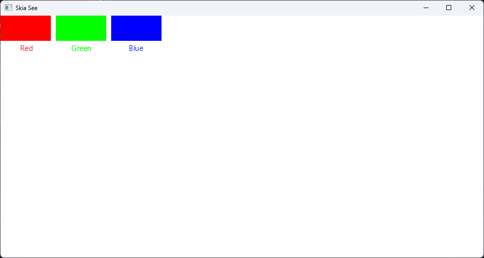

# See++
A C++ GUI library with a non-ambiguous API targeting various rendering backends (currently Skia only with plans to support native drawing)

WARNING: See++ is in a PoC (Proof-of-Concept) state as of now.

# Why See++?
Current C++ GUI libraries don't fully utilize the capabilities of C++, resulting in C-style APIs that are hard to read and pain to manage.
See++ provides a full C++ experience, delivering rich and powerful APIs to construct layouts purely in C++, without the need of ever touching XML, XAML, HTML or any other markup language.

# Why is it named See++?
Because it sounds like C, and it's a graphics library. That's it, that's the reason.

# See in action
Head to the [example program](example/example.cpp) to ***see*** the capabilities of this library (pun intended), as well as understand its APIs and how it manages memory.
